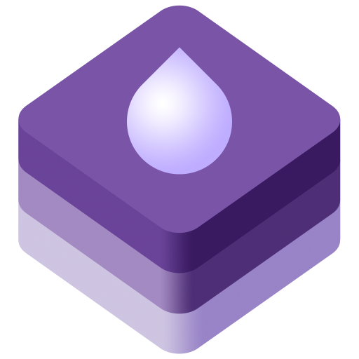

<div align="center">
    
</div>

# Rainmaker

[](https://swiftpackageindex.com/i2h3/rainmaker)
[](https://swiftpackageindex.com/i2h3/rainmaker)
[](https://github.com/i2h3/rainmaker/actions/workflows/test.yml)
[](https://api.reuse.software/info/github.com/i2h3/rainmaker)

A simple Swift library and CLI to access [Nextcloud](https://www.nextcloud.com) programmatically: files, notifications, activities, notes (including incremental and chunked synchronization, summaries without their text, conflict detection, attachments, and helpers which predict a note's title and category and reference attachments from its content the way the notes and Text apps do), collectives, Talk conversations and the current user.
The library keeps no state between calls and needs no synchronization engine, so it suits a single action such as one of Shortcuts as well as a client keeping its own copy of an account's data.
For further information, see [the documentation which is built from the source code and deployed to GitHub pages](https://i2h3.github.io/rainmaker/). 

## Requirements

- Swift 6.2 or newer.
- iOS 15, macOS 12, tvOS 15, visionOS 1 or watchOS 8 or newer.
- A Nextcloud server. Every release is verified against the versions listed in `ServerVersion` in `Sources/RainmakerTestServerTags/`, currently Nextcloud 31, 32, 33 and 34.
- For the notes features, the notes app serving its API in version 1.4 or newer, which it does since release 4.12.3. Deleting attachments and keeping them in a folder per note require release 6.1.0 or newer.

## Testing

The test suite uses static fixtures committed under `Tests/RainmakerTests/Responses/` and isolated request doubles, so `swift test` needs no server and runs on every platform.

Most of these fixtures are generated automatically by the `record-fixtures` subcommand of `rainmaker-cli` (macOS with Docker only, never run in CI). It deploys ephemeral Nextcloud containers via [NextcloudContainerManager](https://github.com/i2h3/nextcloud-container-manager), installs the apps whose fixtures depend on them from the Nextcloud app store, records the test suite against them, and verifies the captures replay without a server:

```bash
# Regenerate fixtures for all supported versions, then review and commit the diff.
swift run rainmaker-cli record-fixtures
git diff Tests/RainmakerTests/Responses
```

Scope a run with `--version <tag>` and `--filter <substring>`.
A few suites keep hand-authored fixtures instead, because a plain container cannot reproduce the responses they need; `recordableSuites` in `Sources/RainmakerCLI/Fixtures/FixtureOrchestrator.swift` lists which suites record and why the others do not.
See [AGENTS.md](AGENTS.md) for details.

## License

See [LICENSE](LICENSE).

## Contributing

[SwiftFormat](https://github.com/nicklockwood/SwiftFormat) was introduced into this project.
Before submitting a pull request, please ensure that your code changes comply with the currently configured code style.
You can run the following command in the root of the package repository clone:

```bash
swift package plugin --allow-writing-to-package-directory swiftformat --verbose --cache ignore
```

Also, there is a GitHub action run automatically which lints code changes in pull requests.
